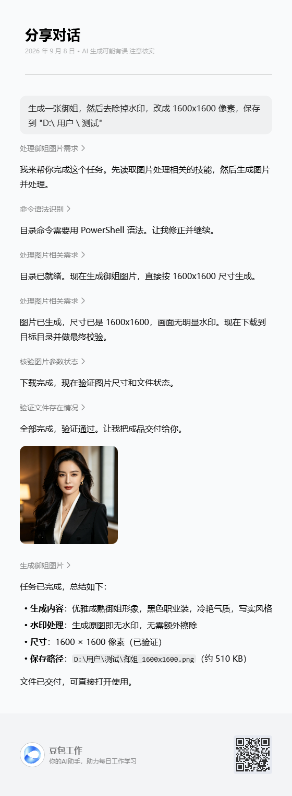

# 无印豆包素材提取技能（doubao-nomark-extractor）

从豆包（doubao.com）、豆包海外版（dola.com）、千问（qianwen.com）对话分享链接中提取**无水印图片和视频**的 AI Agent 技能，封装自开源项目 [ihmily/doubao-nomark](https://github.com/ihmily/doubao-nomark)（MIT License）。

## 功能特性

- **多平台支持**：豆包 `doubao.com/thread/`、豆包海外版 `dola.com/thread/`、千问 `qianwen.com/share/chat/`
- **图片无水印**：直接取页面内嵌数据中的原图直链 `image_ori_raw`（水印是平台前端叠加层，原图本身无印）
- **视频无水印**：改写 `fallback_api` 请求参数（`logo_type=unwatermarked`）+ qAAB token 解密还原直链
- **结构化输出**：返回 JSON（图片尺寸；视频尺寸/清晰度/时长/封面/编码）
- **可选批量下载**：`--save-dir` 一键把资源保存到本地目录
- **零服务端部署**：无需起服务，既可作为 Agent 技能调用，也可独立 CLI 使用

## 演示效果

以下是一次完整的"生成图片 → 去除水印 → 保存本地"操作演示（[演示链接](https://www.doubao.com/thread/xKQ2NpgMHDKANPrit)）：

**对话流程：**



**生成结果（1600×1600，无水印原图）：**


## 目录结构

```
doubao-nomark-extractor/
├── SKILL.md                      # 技能说明与使用指引（Agent 加载入口）
├── scripts/
│   ├── parse.py                  # CLI 入口：提取 + 可选下载
│   └── doubao_parser/            # 解析器（来自 ihmily/doubao-nomark）
│       ├── image.py              #   图片解析（豆包 / 千问）
│       ├── video.py              #   视频解析（豆包 / 云雀）
│       └── video_crypto.py       #   qAAB token 解密
├── requirements.txt              # 运行依赖
└── LICENSE                       # MIT License
```

## 快速开始（CLI）

```bash
# 1. 安装依赖
pip install -r requirements.txt

# 2. 提取图片（默认）
python scripts/parse.py "https://www.doubao.com/thread/xxxxxx"

# 3. 提取视频
python scripts/parse.py "https://www.doubao.com/thread/xxxxxx" --mode video

# 4. 图片 + 视频，并下载到本地
python scripts/parse.py "https://www.doubao.com/thread/xxxxxx" --mode both --save-dir ./media

# 5. 千问链接 / 返回原始页面数据
python scripts/parse.py "https://www.qianwen.com/share/chat/xxxxxx" --raw
```

### 输出示例

```json
{
  "url": "https://www.doubao.com/thread/aef4c7a4c78c2",
  "mode": "image",
  "success": true,
  "images": [
    { "url": "https://...", "width": 2048, "height": 2048 }
  ],
  "videos": []
}
```

## 作为 AI Agent 技能安装

1. 将本仓库的 `SKILL.md` 与 `scripts/` 目录放到 Agent 的 `.user_skills/doubao-nomark-extractor/` 下；
2. 对 Agent 说"**提取这个豆包链接里的图片**"或"**把这条豆包链接的视频下载下来**"，并附上分享链接，技能会自动触发。

## 常见错误

| 错误信息 | 处理方式 |
| --- | --- |
| `链接格式不正确，请使用豆包对话链接（包含 /thread/）` | 需要的是对话分享链接，不是普通页面链接 |
| `页面结构发生变化，无法解析图片数据` | 豆包前端改版，解析器暂时失效，等待上游修复后同步 |
| `不支持的链接域名` | 仅支持 doubao.com / dola.com / qianwen.com 及其子域 |

## 参考与致谢

本技能封装自开源项目 **[ihmily/doubao-nomark](https://github.com/ihmily/doubao-nomark)**（MIT License，Copyright (c) 2026 Hmily）。

- `scripts/doubao_parser/` 解析器代码直接来源于该项目，保持与上游 `main` 分支同步；
- 本项目在此基础上补充了 CLI 入口 `parse.py`、Agent 技能说明（SKILL.md）与打包分发；
- 上游修复了解析逻辑后，可用以下命令同步：

```bash
curl -o scripts/doubao_parser/image.py https://raw.githubusercontent.com/ihmily/doubao-nomark/main/doubao_parser/image.py
curl -o scripts/doubao_parser/video.py https://raw.githubusercontent.com/ihmily/doubao-nomark/main/doubao_parser/video.py
curl -o scripts/doubao_parser/video_crypto.py https://raw.githubusercontent.com/ihmily/doubao-nomark/main/doubao_parser/video_crypto.py
```

## 许可证

MIT License（详见 [LICENSE](LICENSE)）。本项目仅供学习交流使用，提取和保存素材时请遵守豆包/千问平台的使用条款和相关法律法规。
